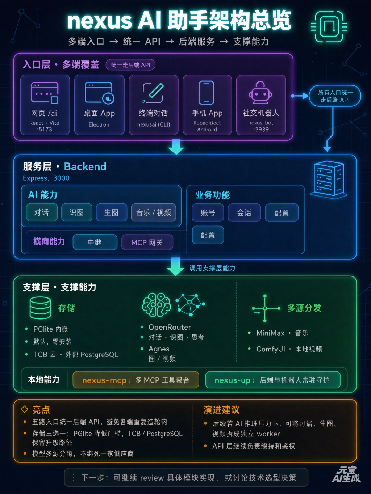

# NEXUS AI

NEXUS AI 是个多模态助手，能跑在自己的电脑或服务器上，包含网页界面、桌面应用、终端对话和微信 / QQ / Telegram 机器人。
对话、识图、生图、音乐、视频全部走公网模型接口（OpenRouter、MiniMax 等），数据默认存在本地内嵌数据库，也可直连外部 PostgreSQL / 云端数据库实现互通。

> 本项目开源免费。模型调用需要你自己的 API Key（OpenRouter 等），与部署方式无关。

---

## 目录

1. [功能特性](#1-功能特性)
2. [架构](#2-架构)
3. [开始前要准备什么](#3-开始前要准备什么)
4. [快速开始：npx 直接从 GitHub 安装](#4-快速开始npx-直接从-github-安装)
5. [手动安装](#5-手动安装)
6. [第一次配置：填 Key、选模型](#6-第一次配置填-key选模型)
7. [怎么用：四个入口](#7-怎么用四个入口)
8. [机器人：把 AI 请进微信群 / QQ 群](#8-机器人把-ai-请进微信群--qq-群)
9. [常驻运行：一直在线、崩了自愈](#9-常驻运行一直在线崩了自愈)
10. [进阶一：生图 / 生视频](#10-进阶一生图--生视频)
11. [进阶二：本地部署模型](#11-进阶二本地部署模型)
12. [进阶三：接 MCP（多工具 / 多厂商）](#12-进阶三接-mcp多工具--多厂商)
13. [把我的模型 / AI 能力接进别的应用](#13-把我的模型--ai-能力接进别的应用)
14. [飞书回传](#14-飞书回传)
15. [链式自动化（Workflow 自动化办公）](#15-链式自动化workflow-自动化办公)
16. [端口与地址速查表](#16-端口与地址速查表)
17. [云端互通（本地连云端数据库）](#17-云端互通本地连云端数据库)
18. [更新与排障](#18-更新与排障)
19. [附：让别人免填 Key（站长中继模式）](#19-附让别人免填-key站长中继模式)
20. [作为技能接入 Agent（SKILL.md）](#20-作为技能接入-agent-skillmd)
21. [开发](#21-开发)

---

## 1. 功能特性

不只是聊天，而是一整套能力：

- 对话 + 识图：网页 / 桌面 / 终端 / 机器人，多轮记忆，能看懂图片
- 终端对话 `nexusai chat`：想问什么直接敲，支持多轮记忆、发图识图（`@图片路径`，可一次多张）
- 桌面应用 `nexusai`：GUI 窗口，自动拉起后端与前端
- 网页界面 `nexusai serve`：浏览器访问 `http://localhost:5173`，功能最全
- 手机 App：Capacitor 打包的安卓端，形态与网页一致
- 机器人接入：微信、QQ、Telegram、Discord、企业微信（按需开启）
- 文生图 / 图生图：网页「图像 / Agnes」页；文生图联网即可，图生图 / 视频需配 `AGNES_API_KEY`
- 文生视频 / 图生视频：云端免费接口，或本地 ComfyUI
- AI 音乐：一句话生成完整曲目
- 自动化办公（Workflow）：链式任务，结果可回传飞书
- 账号与计费：自托管免费档 + 付费套餐，支持 PayPal 收款（站长可开启）
- 本地模型接入：Ollama、LM Studio、vLLM 直接接
- MCP 聚合：CLI + 后端共享配置，接多个厂商 / 本地 MCP 工具，对话时自动调用
- 本地存储 / 云端互通：默认存本地内嵌数据库；也可直连外部 PostgreSQL / 云端数据库，两边数据一致

## 2. 架构

所有入口都是「瘦客户端」，能力集中在同一个后端。网页、桌面、终端、手机、社交机器人只是不同的壳；后端向下对接「模型层」（各家 AI 接口）与「存储层」（内嵌或云端数据库），并通过 MCP 层接入外部工具。



```
用户触点（任一入口都能用）
  ├─ 网页 /ai         React + Vite         :5173
  ├─ 桌面 App         Electron
  ├─ 终端对话         nexusai (CLI)
  ├─ 手机 App         Capacitor (Android)
  └─ 社交机器人       nexus-bot             :3939
          │
          ▼ 所有入口统一走后端 API：http://localhost:3000/api
┌─ 服务层 · Backend（Express, :3000）
│  对话 / 识图 / 生图 / 音乐 / 视频
│  账号 / 会话 / 计费 / 配置 / 中继 / MCP 网关
└────────────────────────────────────
          │
          ▼
┌─ 支撑层
│  存储：PGlite 内嵌 · TCB 云 · 外部 PostgreSQL
│  模型：OpenRouter（对话·识图·思考）· Agnes（图/视频）· MiniMax（音乐）· ComfyUI（本地视频）
│  能力：nexus-mcp（多 MCP 工具聚合）· nexus-up（后端与机器人常驻守护）
└────────────────────────────────────
```

### 模块清单

| 目录 | 角色 | 技术 | 端口 |
|------|------|------|------|
| `frontend/` | 网页界面 + 手机 App 界面 | React + Vite + Tailwind + shadcn/ui | `5173`（开发） |
| `electron/` | 桌面应用外壳，自动拉起后端与前端 | Electron | — |
| `cli/nexusai.mjs` | 终端对话、启动服务、打开桌面、常驻管理 | 纯 Node（零第三方依赖） | — |
| `cli/mcp-client.mjs` | CLI 侧多 MCP 客户端（stdio + HTTP 两种） | 纯 Node | — |
| `backend/` | 全部业务能力与 AI 代理 | Express + TypeScript | `3000` |
| `backend/web/` | 前端构建产物，由后端一并托管（单端口部署时） | — | 复用 `3000` |
| `nexus-bot/` | 社交平台机器人网关 | TypeScript + tsx | `3939` |
| `nexus-mcp/` | 自研 MCP 服务器（知识库 / 能力清单 / nexus_chat） | @modelcontextprotocol/sdk | `8787` / stdio |
| `installer/` | npm 安装器 `nexus-ai`，用于 `npx` 安装 | 纯 Node | — |
| `scripts/nexus-up.sh` | 后端 + 机器人双进程常驻守护（仅 Linux / macOS / Git Bash / WSL） | Bash | — |
| `start-local.bat` | Windows 原生一键启动后端 + 前端（无需 Git Bash） | Batch | — |
| `scripts/nexus.service` | 开机自启样例（Linux systemd） | systemd | — |
| `docs/` | 架构图等文档资源 | — | — |
| `skill/` | 作为技能接入 Agent 的参考文档与脚本 | — | — |

### 后端接口分区

后端按业务拆成独立模块，挂载在不同前缀下（全部在 `/api` 之下）：

| 前缀 | 模块 | 作用 |
|------|------|------|
| `/api` | `system` | 健康检查、系统信息 |
| `/api/ai` | `ai` | 对话（`/chat`、`/chat/stream`、`/v1/*` OpenAI 兼容），多模型链自动切换 |
| `/api/image` | `image` | 文生图（Pollinations，免费） |
| `/api/agnes` | `agnes` | 文生图 / 图生图 / 文生视频 / 图生视频 |
| `/api/music` | `music` | 音乐生成（MiniMax / Suno / HuggingFace / Replicate / ACE） |
| `/api/video` | `video` | 图生视频 / 文生视频（ComfyUI） |
| `/api/auth` | `auth` | 自托管账号（JWT）注册登录 |
| `/api/relay` | `relay` | 公开中继：注册 / 登录 / 每日额度 |
| `/api/histories` | `histories` | 聊天记录 |
| `/api/conversations` | `conversations` | 会话管理 |
| `/api/mcp` · `/api/servers` | `mcp` + `mcpAggregator` | MCP 转发网关（JSON-RPC 透传）+ 多 MCP 聚合状态 |
| `/api/billing` | `billing` | 套餐 / 订阅 / 订单 / 用量 |
| `/api/config` | `config` | 云端用户配置（多租户隔离） |

### 四条主要链路

**A · 网页 / 桌面**　浏览器(`5173`) → Vite 代理 `/api` → 后端(`3000`) → 模型层 / 存储层。桌面版由 Electron 自动拉起后端和前端，窗口内加载 `http://localhost:5173`。

**B · 终端对话**　`nexusai chat` → 直接调模型接口（不经后端）。若配了 MCP，会先连上这些 server、把工具表交给模型，由模型自己决定调用哪个工具，多轮跑完再输出。

**C · 社交机器人**　微信 / QQ / Telegram / Discord / 企业微信 → `nexus-bot`(`3939`) 统一成标准消息 → POST 后端 `/api/ai/v1/chat/completions` → 回复按原路回传平台。

**D · 外部应用接入**　任何第三方应用 → 后端 OpenAI 兼容接口 `http://localhost:3000/api/ai/v1/chat/completions`（带 `AI_BOT_TOKEN` 或用户 Key 鉴权）→ 模型层。也就是把你的模型能力开放成一整套标准接口。

### 存储层

存储有三种形态，但「外部 PostgreSQL」**不是**靠改 `DB_MODE` 切换的——它要保持 `DB_MODE=local` 再填 `DATABASE_URL`（见「云端互通」）。`DB_MODE` 只在「内嵌」与「云端 TCB」之间切换：

- 默认用 PGlite：内嵌的 PostgreSQL（纯 WASM），数据落在本地 `nexus-data/` 目录（前提是后端读到了 `.env`；用安装器装的人默认就是这个，裸跑 `pnpm -C backend dev` 且没建 `.env` 的人则是 `cloud`）
- TCB 云端：托管 PostgreSQL，服务器自动配置（`DB_MODE=cloud`）
- 外部 PostgreSQL：保持 `DB_MODE=local` 并填 `DATABASE_URL`，即可与云端共用同一份数据，两边互通

### 模型层

对话默认走 OpenRouter 的 OpenAI 兼容接口，可换 DeepSeek / GLM / Kimi 等任意兼容服务。后端维护多模型链：对话、识图、深度思考各有一条链，主模型被限流或下架时自动切到下一个；CLI 侧同样会自动换用可用模型并记住选择。

### 能力层与运维层

- `nexus-mcp`：既能作为独立 MCP 服务器对外提供工具，也能被后端的 `/api/mcp` 网关转发
- 多 MCP 聚合：CLI 与后端共享同一份 `~/.nexusai/mcp-servers.json`，可同时接入多个本地进程（stdio）或远程（HTTP）MCP server，工具名自动加前缀去重
- `nexus-up`：把后端和机器人做成后台常驻，谁崩了自动拉起，附 `systemd` 配置可开机自启

### 技术栈

| 层 | 技术 |
|----|------|
| 前端 / 网页 | React 18 + TypeScript + Vite + Tailwind CSS + shadcn/ui（Radix）+ Framer Motion + TanStack Query + React Router |
| 桌面 | Electron |
| 手机 | Capacitor（Android） |
| 后端 | Node.js + Express + TypeScript + Zod + JWT |
| 机器人 | TypeScript + discord.js + ws |
| 终端 CLI | Node.js 单文件零依赖（`cli/nexusai.mjs`） |
| MCP | @modelcontextprotocol/sdk（nexus-mcp 服务端）；CLI / 后端手写零依赖聚合客户端 |
| 数据 | PGlite（内嵌 WASM）/ TCB 托管 PostgreSQL / 外部 PostgreSQL |
| 模型 | OpenRouter · Agnes · MiniMax · Suno · HuggingFace · Replicate · ComfyUI · Ollama |
| 安装 | `npx`（installer/）+ pnpm workspace |

### 数据与配置落点

| 内容 | 位置 |
|------|------|
| 终端配置 | `~/.nexusai/config.json`（优先级最高） |
| 后端配置 | `backend/.env` |
| 机器人配置 | `nexus-bot/.env` |
| MCP 聚合配置 | `~/.nexusai/mcp-servers.json` |
| 本地数据 | `nexus-data/`（PGlite 数据目录） |
| 常驻日志 | `.nexus-runtime/logs/` |

---

## 3. 开始前要准备什么

需要准备的东西不多：

1. 一台能联网的电脑或服务器（Windows / macOS / Linux 都行）。
   - 想 24 小时在线当机器人服务器 → 用一台云电脑（本机一休眠机器人就掉线）。
2. Git（用来从 GitHub 拉代码）。没装的去 https://git-scm.com 装。
3. Node.js ≥ 18 和 pnpm。
   - 装 Node：https://nodejs.org （选 LTS）
   - 装 pnpm：装好 Node 后，命令行跑 `npm install -g pnpm`
4. 一个 AI Key（下面任意一家都支持，用你手头有的那家就行）。
   - 想省事 → OpenRouter：https://openrouter.ai/keys 注册就有免费额度。
   - 已经有别家 Key → OpenAI / DeepSeek / 智谱 GLM / 通义千问 / Kimi / 硅基流动 都能直接用，不必为了跑这个项目专门去注册 OpenRouter。
   - 这就是后面要填的 `AI_API_KEY`。
5. 可选：
   - 想跑高质量本地生图 / 生视频 → 需要一张显卡 + 自己部署 ComfyUI（见「进阶一」）。
   - 想接本地大模型（Ollama 等）→ 本机再装个 Ollama 即可。
   - 想开微信 / QQ 机器人 → 需要对应平台的账号 / 审核通过的机器人（见「机器人」一节）。

> 纯断网是跑不了的，因为默认模型在云端。接了本地模型（Ollama）后可以不依赖外网，但配置阶段还是要联网。

---

## 4. 快速开始：npx 直接从 GitHub 安装

在装好 Node.js 的电脑上，一行命令即可——直接从 GitHub 仓库下载安装，不用手动 git clone：

```bash
npx github:2740354108/nexus-ai
```

安装器会自动做这些事：

- 检查 / 安装 pnpm
- 从 GitHub 克隆项目到当前目录的 `nexus-ai/`
- 安装依赖（内含内嵌数据库 PGlite，不用装任何数据库软件）
- 生成配置、注册 `nexusai` 全局命令

装完验证一下：重开一个终端，敲

```bash
nexusai help
```

能看到命令列表就成功了。

> 若终端提示「无法将 `nexusai` 项识别为 cmdlet / command not found」，说明全局命令没进 PATH：重开一个终端窗口再试；仍不行就进项目目录用 `pnpm nexusai chat`，效果一样。

想装到指定目录：

```bash
npx github:2740354108/nexus-ai my-folder
```

> `npx github:` 形式首次运行会把桌面打包工具（Electron）一起装上，属正常一次性下载，稍大；若想更轻量，可改用下面的手动安装。

### 另一种方式：先发布 npm 安装器，安装更快

如果你希望别人用更短的 `npx nexus-ai`（不拉桌面构建依赖），可把 `installer/` 这个小包发布到 npm：

```bash
cd installer && npm publish
```

之后别人用 `npx nexus-ai` 即可（效果与 `npx github:` 一致，只是安装器本身来自 npm）。

> 无论哪种方式，最终装的都是同一个 GitHub 项目。`installer/installer.mjs` 里的 `REPO` 作为兜底地址，一般不用改。

---

## 5. 手动安装

```bash
# 1. 克隆
git clone https://github.com/2740354108/nexus-ai.git
cd nexus-ai

# 2. 装依赖（根目录 + 各子目录，共 5 次）
pnpm install                # 根目录
pnpm -C backend install     # 后端
pnpm -C frontend install    # 前端
pnpm -C nexus-bot install   # 机器人（只玩网页/终端可不装）
pnpm -C nexus-mcp install   # MCP 服务器（接 MCP 工具必装）
pnpm -C nexus-mcp build     # 把 MCP 服务器从 TypeScript 构建成 JS

# 3. 第一次必做：配置 AI Key（向导式，自动写文件）
pnpm nexusai setup

# 4. 启动
pnpm nexusai chat      # 终端对话
pnpm nexusai serve     # 网页（浏览器开 http://localhost:5173）
pnpm nexusai app       # 桌面应用
```

> 开发者模式单独起各服务：
>
> ```bash
> cd backend   && pnpm dev      # 后端 :3000
> cd frontend  && pnpm dev      # 前端 :5173
> cd nexus-bot && pnpm start    # 机器人
> ```

---

## 6. 第一次配置：填 Key、选模型

### 6.1 用向导

```bash
nexusai setup
```

它会问两种用法，选一个：

- 用法 1（自带 Key）：选「用自己的 Key」，再挑一家平台（见下表），把该平台的 Key 粘进去。向导会自动带出对应的服务地址和常用模型，并现场验证一次，通过才保存。无限流，Key 只存在本地。
- 用法 2（连中继）：如果知道某个站长部署的中继地址，选这个填进去，可免自己申请 Key（但有每日额度）。自己没部署中继不要选这个。

向导里可选的平台，地址和模型都由向导自动填好，你只出 Key：

| 选哪家 | 服务地址 | Key 去哪拿 |
|--------|----------|-----------|
| OpenRouter | `https://openrouter.ai/api/v1` | https://openrouter.ai/keys （有免费额度） |
| OpenAI 官方 | `https://api.openai.com/v1` | https://platform.openai.com/api-keys |
| DeepSeek | `https://api.deepseek.com/v1` | https://platform.deepseek.com/api_keys |
| 月之暗面 Kimi | `https://api.moonshot.cn/v1` | https://platform.moonshot.cn/console/api-keys |
| 智谱 GLM | `https://open.bigmodel.cn/api/paas/v4` | https://open.bigmodel.cn/usercenter/apikeys |
| 通义千问（百炼） | `https://dashscope.aliyuncs.com/compatible-mode/v1` | https://bailian.console.aliyun.com |
| 硅基流动 | `https://api.siliconflow.cn/v1` | https://cloud.siliconflow.cn/account/ak |
| 其它 | 自己填 | 任何 OpenAI 兼容服务都可以 |

> 换平台时模型名会跟着换（例如 DeepSeek 用 `deepseek-chat`），向导会自动写进配置，不用手改。
> 识图（发图片）能力各家支持程度不同，个别平台没有识图模型时只影响发图片，不影响文字对话。

配置会写进两个地方（优先级：`~/.nexusai/config.json` > `backend/.env`）：

- `backend/.env` —— 网页 / 桌面端读取
- `~/.nexusai/config.json` —— 终端读取，更新代码不会丢

随时查看当前配置：`nexusai config`

### 6.2 后端 `backend/.env` 关键项（网页 / 桌面端用）

| 配置 | 说明 | 默认 |
|------|------|------|
| `AI_API_BASE` | AI 服务地址。任何 OpenAI 兼容服务都行（OpenRouter / OpenAI / DeepSeek / 智谱 / 通义 / Kimi / 硅基流动…）；连中继填 `…/api/ai/v1` | openrouter |
| `AI_API_KEY` | **必填**。自带 Key 模式填自己的模型密钥；连中继模式填中继的公开令牌 | 空 |
| `AI_MODEL` | 对话主模型 | 免费模型，会随上下架变化 |
| `AI_MODEL_THINK` | 深度思考（推理）模型 | `deepseek/deepseek-r1:free`（OpenRouter 模型 ID 须带厂商前缀；具体默认以 `backend/.env.example` 为准） |
| `AI_VISION_MODEL` / `AI_VISION_FALLBACKS` | 识图模型链（发图片时自动切） | 免费视觉模型 |
| `DB_MODE` | `local`（默认，内嵌数据库）或 `cloud`（云端 TCB） | local |
| `NEXUS_DATA_DIR` | 内嵌数据库存放目录 | `./nexus-data` |
| `DATABASE_URL` | 可选，填 `postgresql://…` 则改用外部 PostgreSQL（与云端共用数据） | 空 |
| `AGNES_API_BASE` | Agnes 多模态服务地址（与下一项配套） | `https://apihub.agnes-ai.cn/v1` |
| `AGNES_API_KEY` | Agnes 多模态（文生图/视频）密钥，没有则那一块不可用 | 空 |
| `COMFYUI_URL` | 本地 ComfyUI 地址（高质量生图/视频用） | http://localhost:8188 |
| `ACEMUSIC_API_KEY` | AI 音乐（ACE-Step）。不填也能用其它音乐 provider | 空 |
| `AI_BOT_TOKEN` | 开中继模式才设（站长用） | 空 |

AI 密钥获取：OpenRouter 可免费申请 https://openrouter.ai/keys ；也可直接用你已有的 OpenAI / DeepSeek / 智谱 / 通义 / Kimi / 硅基流动 Key —— 把上表的服务地址填进 `AI_API_BASE` 即可（`nexusai setup` 会自动填）。

> 仓库默认不内置任何可用服务器地址，装完须配置一次。如果看到 `Hostname/IP does not match certificate` 报错，说明地址填的是示例占位域名，运行 `nexusai setup` 重新填写即可。
>
> 免费模型会随时上下架，CLI / 后端都会自动切换当前可用模型，一般不用手改模型名。

### 6.3 前端「设置页」（网页 / 手机端对话用）

网页端对话**走后端**（`POST /api/ai/chat/stream`），只是把你在设置页填的 `chatApiBase` / `openrouterKey` / `chatModel` 作为请求体交给后端去代理转发，并不在前端直连模型服务。打开网页 → 设置，可以配：

- `chatApiBase` + `openrouterKey` + `chatModel`：对话接口地址、密钥、模型名。字段名叫 `openrouterKey` 是历史原因，填任意平台的 Key 都行（配合 `chatApiBase` 指到那家平台）；默认 OpenRouter，也可改成 Ollama / LM Studio / vLLM
- `chatModelThink`：深度思考模型
- `pollinationsToken`：生图令牌（不填也能画）
- `comfyUrl` / `comfyCheckpoint` / `comfyUnet` / `comfyVae` / `comfyClipVision`：本地 ComfyUI 生图 / 视频
- `workflowUrl` / `workflowKey`：自动化办公自建服务（见「链式自动化」）
- `feishuWebhook`：飞书回传（见「飞书回传」）
- `routerEndpoint` / `routerModel` / `routerApiKey`：备用模型，主模型可自动把子任务转给它

> 两套配置的区别：后端 `.env` 是「服务端」用的（机器人、对外接口、音乐 / 视频生成）；前端设置页是「网页 / 手机端填写的接口与 Key」，网页端对话时会把这些发给后端、由后端代理请求模型。想让网页端用本机的 Ollama，就改前端设置页里的 `chatApiBase`；想让机器人和对外接口用某个模型，就改后端 `.env`。

---

## 7. 怎么用：四个入口

### 7.1 网页端（功能最全）

```bash
nexusai serve
```

浏览器打开 http://localhost:5173 。里面的标签页大致有：

- 智能对话：聊天 + 发图识图 + 深度思考 / 联网开关
- AI 音乐：一句话生成曲目
- 图生视频：上传一张图让它动起来（或文生视频）
- 图像 / Agnes：文生图（Pollinations，免费）、高质量生图（ComfyUI）、文生图 / 图生图 / 文生视频 / 图生视频（Agnes，需 `AGNES_API_KEY`）
- 自动化：Workflow 链式任务 + 飞书回传（见「链式自动化」）
- 我的空间 / 设置：历史、配置、模型切换

### 7.2 终端 CLI

```bash
nexus                 # 短命令，直接进对话（没配置会自动弹向导）
nexusai               # 同上
nexusai chat          # 显式进入终端对话
```

对话里能用的小技巧：

- `@图片路径 描述` —— 发图识图（支持一次多张：`@a.png @b.jpg 对比这两张`）
- `/clear` —— 清空上下文
- `/exit` 或 Ctrl+D —— 退出
- `/mcp` —— 查看已接入的 MCP 工具（见「进阶三」）
- 思考时有旋转光标，不再干等

常用命令一览：

| 命令 | 作用 |
|------|------|
| `nexus` | 一敲直接进终端对话；未配置时自动弹配置向导 |
| `nexus setup` | 配置向导：填 AI Key 或中继地址（第一次必做） |
| `nexus config` | 查看当前配置、服务地址、Key、版本与登录状态 |
| `nexus update` | 更新到最新版本（自动拉代码 + 装依赖） |
| `nexusai` / `nexusai app` | 打开桌面应用（GUI） |
| `nexusai chat` | 终端对话，直接输入问题 |
| `nexusai register 邮箱 密码` | 注册中继账号并领取每日免费额度 |
| `nexusai login 邮箱 密码` | 登录已有中继账号 |
| `nexusai me` | 查看当前登录与每日额度剩余 |
| `nexusai serve` | 启动后端 + 前端，浏览器访问 `http://localhost:5173` |
| `nexusai up` / `up status` / `up stop` / `up restart` | 常驻管理（见「常驻运行」） |
| `nexusai help` | 帮助 |

### 7.3 桌面端

```bash
nexusai app
```

会弹出一个 GUI 窗口，自动拉起后端与前端，适合不想开浏览器的情况。打包 Windows 安装包：

```bash
pnpm install && pnpm pack:win    # 生成 dist-electron/ 下的 exe（必须在 Windows 本机打）
```

> exe 必须在本机打包，云端环境无法生成 Windows 安装包。

### 7.4 手机 App

前端用 Capacitor 打包安卓端，安装到手机后形态和网页一致，含「自动化」标签页。安卓端完整打包 / 签名发布不在本文范围（需本地 Android SDK + Capacitor 环境，按官方流程操作即可）。

---

## 8. 机器人：把 AI 请进微信群 / QQ 群

机器人是一个独立程序 `nexus-bot`，它自己不聪明，只是把微信 / QQ 等平台的消息转给后端（localhost:3000）去算：

> 机器人能不能用，取决于后端在不在跑。后端没起，机器人就「连不上后端」没声。

### 8.1 配置 `nexus-bot/.env`

机器人目录下有 `.env.example`，复制成 `.env` 后按平台开启。关键项：

| 变量 | 作用 |
|------|------|
| `NEXUS_API_BASE` | 后端地址，默认 `http://localhost:3000/api/ai/v1`，和后端同机就填这个 |
| `OPENROUTER_API_KEY` / `BOT_MODEL` | 机器人直连模型用（也可只靠后端，留空也行） |
| `ENABLE_TELEGRAM` + `TELEGRAM_BOT_TOKEN` | Telegram，填 Token 即可，本地就能跑 |
| `ENABLE_DISCORD` + `DISCORD_BOT_TOKEN` | Discord，填 Token |
| `ENABLE_QQ` + `QQ_BOT_APPID` / `QQ_BOT_TOKEN` / `QQ_BOT_SECRET` | QQ 官方机器人（需开放平台审核发布） |
| `ENABLE_ONEBOT` + `ONEBOT_WS_URL` | OneBot / NapCat（挂在自己 QQ 上，能收全部消息，无 5 秒限制） |
| `ENABLE_WECOM` + 企业微信参数 | 企业微信（群机器人 webhook 或企业应用） |
| `ENABLE_WECHAT_MP` + 小程序参数 | 微信小程序 / 微信 iLink |
| `BOT_SYSTEM_PROMPT` | 自定义机器人人设（不填用默认） |
| `BOT_HEALTH_PORT` | 健康检查端口，默认 3939 |

### 8.2 各平台怎么开

- Telegram / Discord：去对应平台申请 Bot Token，填上 `ENABLE_*` 和 Token，本地就能跑，不需要公网。
- QQ 官方机器人：去 QQ 开放平台创建机器人，拿到 appid / token / secret，填好。必须审核发布后才会推送消息。
- OneBot（NapCat / LLOneBot）：在自己登录的 QQ 上挂一个 OneBot 框架（如 NapCat），让它暴露 WebSocket（默认 `ws://127.0.0.1:3001`），机器人填 `ENABLE_ONEBOT=true` 即可。能收群里所有消息、没有官方机器人的 5 秒被动回复限制。
- 企业微信 / 微信小程序：按需填企业微信或微信小程序的参数。

启动机器人：

```bash
cd nexus-bot && pnpm start
```

### 8.3 让机器人不掉线

机器人依赖后端常驻，见「常驻运行」。最简单的方式是在同一台机器用 `nexusai up` 把后端 + 机器人一起守护起来，谁崩了自动重启（仅 Linux / macOS / Git Bash / WSL；Windows 原生请用根目录的 `start-local.bat`）。

### 8.4 常见机器人故障

- 「连不上后端」：后端没起，或端口被抢。先用 `nexusai up status` 看后端在不在跑。
- 「动不动没声」：
  1. 后端没常驻（用「常驻运行」解决）；
  2. QQ 官方机器人的「被动回复 5 秒窗口」——模型一慢，回复超时会被吞（换 OneBot 方案可解决）；
  3. 免费模型偶发限流。
- 图片收不到：QQ 官方机器人只能看到「@它那条消息」里带的图；OneBot 没有这个限制。

---

## 9. 常驻运行：一直在线、崩了自愈

适合：云电脑 / 服务器上 24 小时挂着，让机器人保持在线。

项目里自带守护脚本 `scripts/nexus-up.sh`（纯 bash，零依赖，仅 Linux / macOS / Git Bash / WSL；Windows 原生请用根目录的 `start-local.bat`），它会同时守护后端和机器人，任何一个崩了 2 秒后自动重启。

```bash
# 在项目根目录
nexusai up                 # 后台启动并守护（等效 ./scripts/nexus-up.sh start，仅 Linux / macOS / Git Bash / WSL）
nexusai up status          # 看在不在跑、进程号
nexusai up stop            # 停止
nexusai up restart         # 重启
```

日志落在 `.nexus-runtime/logs/`（backend.log / bot.log），出问题一眼能看到。

云电脑开机自启（Linux）：把 `scripts/nexus.service` 放到 `/etc/systemd/system/nexus.service`，改里面的 `WorkingDirectory`（项目路径）和 `User`，然后：

```bash
sudo systemctl daemon-reload
sudo systemctl enable --now nexus
```

之后云电脑重启会自动拉起，机器人不再掉线。

> 注意：机器人和后端要在同一台机器跑（脚本就是这么干的），这样机器人连 `localhost:3000` 才稳。

---

## 10. 进阶一：生图 / 生视频

生图 / 生视频分三档，对硬件要求各不相同：

| 能力 | 入口 | 需要什么 | 难度 |
|------|------|----------|------|
| 文生图 | 网页「图像」页 | 联网即可（Pollinations 免费） | 零 |
| 图生图 / 文生视频 / 图生视频 | 网页「图像 / Agnes」页 | 配 `AGNES_API_KEY`（或云端已配） | 低 |
| 高质量自定义生图 / 视频 | 网页「图像 / 图生视频」页（切 ComfyUI） | 本地 ComfyUI + 显卡 + 模型 | 高 |

- 普通文生图：本地部署完能联网直接玩，什么都不用装。
- Agnes 多模态：在后端 `.env` 配 `AGNES_API_KEY`（没有的话那一块不可用，但不影响对话和文生图）。
- 本地 ComfyUI（高质量）：自己部署 ComfyUI（默认 `http://localhost:8188`），在前端设置页填 `comfyUrl` 和模型名（`comfyCheckpoint` / `comfyUnet` / `comfyVae` / `comfyClipVision`）。视频还需要装 ComfyUI 的视频相关节点（如 `ComfyUI-VideoHelperSuite`）。

> 普通生图本地部署完直接就能玩；想要最高质量或自定义模型，才需要自己跑 ComfyUI。

> 额度提醒：自托管免费档每天大致配额——对话 50 次、生图 10 次、视频 2 次、音乐 2 次（在 `backend/src/modules/billing.ts` 可调）。中继模式是**另一套**额度，不沿用上面的免费档：走公开中继模式（`AI_BOT_TOKEN`）时按 `RELAY_DAILY_LIMIT`（默认 20 次/天）计，需先 `nexusai register` 注册登录（详见「附：站长中继模式」）。

---

## 11. 进阶二：本地部署模型

可以不依赖云端模型，用自己电脑上的开源模型（Ollama / LM Studio / vLLM）。

### 11.1 支持的服务

| 服务 | 地址格式 | 说明 |
|------|----------|------|
| Ollama | `http://本机IP:11434/v1` | 先 `ollama serve`，并把 `OLLAMA_HOST` 设为 `0.0.0.0` 允许局域网 |
| LM Studio | `http://本机IP:1234/v1` | 打开 Local Server，允许局域网访问 |
| vLLM / 自建网关 | `http://地址/v1` | 任意 OpenAI 兼容接口 |

### 11.2 在网页 / 手机端接（前端直连）

打开网页「设置」→ 把 `chatApiBase` 改成上面的地址，`chatModel` 填本地模型名（如 `qwen2.5:7b`），`openrouterKey` 本地模型可留空。这样网页端对话就走本地模型了。

### 11.3 在后端 / CLI 接

后端 `.env` 改 `AI_API_BASE` 和 `AI_API_KEY`（本地可空）、`AI_MODEL` 为本地模型名。CLI 用 `nexusai setup` 重填即可。改完重启后端（`nexusai up restart`）。

### 11.4 在 MCP 里接本地模型

`nexus-mcp` 也支持本地模型（Ollama），配 `.env` 即可让 MCP 工具调用本地模型。

---

## 12. 进阶三：接 MCP（多工具 / 多厂商）

MCP（Model Context Protocol）能把「文件系统、GitHub、各家厂商工具」等聚合进 NEXUS，对话时 AI 自己挑着用。

### 12.1 配置文件

前后端共享一份配置：`~/.nexusai/mcp-servers.json`。示例：

```json
{
  "servers": [
    {
      "name": "filesystem",
      "enabled": true,
      "transport": "stdio",
      "command": "npx",
      "args": ["-y", "@modelcontextprotocol/server-filesystem", "/要开放的目录"],
      "env": {}
    },
    {
      "name": "my-vendor",
      "enabled": true,
      "transport": "http",
      "url": "https://厂商地址/mcp",
      "headers": { "Authorization": "Bearer 令牌" }
    }
  ]
}
```

两种形态都支持：

- stdio（本地进程型）：`command` + `args` 启动，如 filesystem、GitHub。
- http（远程型）：给个 `url` + token 就能连厂商云 MCP。

### 12.2 在 CLI 里用

```bash
nexusai            # 进对话，工具自动带上
/mcp               # 随时看接入状态、工具清单
```

对话时 AI 会自动跨厂商调用这些工具（比如一边读本地文件、一边调某厂商接口）。

### 12.3 在后端 / 网页用

后端非流式对话也接入了 MCP 工具循环，可用 `GET /api/servers` 查看已连 server 与工具（网关转发走 `/api/mcp`）。默认没启用任何 server 时对线上零影响。

---

## 13. 把我的模型 / AI 能力接进别的应用

NEXUS 后端就是一个 OpenAI 兼容网关 + 一个 MCP 服务。但能接什么、不能接什么要分清：

- 接法 A · OpenAI 兼容：适合纯聊天类客户端和自写代码（OpenAI SDK / LangChain 等）。把 Base URL 指向 NEXUS 即可，流式、非流式都行。
- 接法 B · MCP：适合 Cursor、Cline、Claude Desktop 等 Agent 类工具。它们要的是「工具」而不是「模型端点」，走 MCP 才连得上。

> 一个关键限制：NEXUS 的 OpenAI 兼容接口只做对话补全，不转发客户端的 `tools` / function call。所以靠工具调用驱动的 Agent 类工具（编码 Agent、编辑器的 Agent 面板）不能靠 Base URL 直连，请走 MCP；纯聊天类客户端不受影响。

> 不管用哪种，先确认后端在跑：`nexusai up` 或 `nexusai serve`（端口 3000）。

### 13.1 接法 A：OpenAI 兼容（通用）

在对方工具里找「Base URL / API Base / Endpoint / Server URL」这类字段，统一填：

```
http://localhost:3000/api/ai/v1        # 同一台机器
http://<服务器IP或域名>:3000/api/ai/v1  # 别的机器 / 云电脑
```

另外两个必填项：

| 字段 | 填什么 |
|------|--------|
| API Key | 任意非空字符串（本机直连不校验）；若开了中继模式（`AI_BOT_TOKEN`），就填那个 token |
| Model | 任意（实际模型由服务端模型链决定，主模型被限流会自动换下一个） |

请求体就是标准 OpenAI 格式：

```json
{
  "model": "nexus",
  "messages": [{ "role": "user", "content": "你好" }],
  "stream": false
}
```

示例调用（curl / Python）：

```bash
curl http://localhost:3000/api/ai/v1/chat/completions \
  -H "Content-Type: application/json" \
  -H "Authorization: Bearer <任意非空或 AI_BOT_TOKEN>" \
  -d '{"model":"nexus","messages":[{"role":"user","content":"你好"}],"stream":false}'
```

```python
from openai import OpenAI
c = OpenAI(base_url="http://localhost:3000/api/ai/v1", api_key="任意非空")
print(c.chat.completions.create(model="nexus", messages=[{"role":"user","content":"你好"}]).choices[0].message.content)
```

### 13.2 哪些工具能接、哪些接不了

先记一条：这个接口只做「对话补全」。所以能不能接，看对方是不是纯聊天——**能纯聊天的能接，靠 function calling（工具调用）干活的接不了。**

| 工具 / 应用 | 类型 | 能接吗 | 配置入口（大致位置） |
|------------|------|--------|---------------------|
| **ChatBox / Cherry Studio / LobeChat / LibreChat / Open WebUI** | 聊天客户端 | 可以 | 设置里添加 OpenAI 兼容供应商，填 Base URL |
| **AnythingLLM / SillyTavern** | 知识库 / 角色聊天 | 可以 | Provider 选 OpenAI（兼容） |
| **Dify / n8n / Flowise** | 工作流 / 自动化 | 可以（对话节点） | 模型供应商 / 节点里选自定义 OpenAI |
| **LangChain / 自写代码 / OpenAI SDK** | 开发框架 | 可以（流式、非流式实测通过） | `OpenAI(base_url=...)` |
| **LiteLLM / OpenRouter / AI快站 等网关** | 聚合网关 | 可以 | 把 NEXUS 当成一个上游 Base URL 接入 |
| **Cursor** | 编码助手 | 仅 Chat 面板；Agent / Composer 不行 | Settings → Models → 自定义 Base URL |
| **Continue** | 编码插件 | chat 可以，agent / edit 不行 | `config.json` 的 `apiBase` |
| **Aider** | 命令行编码 | 看模式，主要靠 diff / tool calling，未必可用 | `--openai-api-base` |
| **Cline / Roo Code** | VS Code 编码插件 | 不行，完全依赖工具调用 | 请走 MCP（接法 B） |
| **Codex / 类 Codex** | 编码 | 不行，agentic 依赖工具调用 | 请走 MCP |
| **Windsurf / Zed（agent 模式）** | 编辑器 | 不行，agent 面板依赖 tools | 请走 MCP |
| **Claude Code** | 命令行 Agent | 不行，协议不对（Anthropic 原生），需转译层 | 请走 MCP |
| **WorkBuddy（CodeBuddy）/ Hermes Agent** | 桌面 / 多端 Agent | 可配 OpenAI 兼容，纯聊天可用；Agent 能力看它是否依赖工具调用 | 见 13.3 |

> 记法：**能纯聊天的能接；要「动手干活」（tool use / agent）的接不了——那类走 MCP。**

### 13.3 几个常见客户端怎么填

- WorkBuddy（CodeBuddy）：`设置 → 模型 → 新建自定义模型`，类型选「OpenAI 兼容」；Base URL 填 `http://localhost:3000/api/ai/v1`，API Key 填任意非空，Model 随便写。纯聊天可用；它若用工具调用来干活，那部分需要一个支持 tools 的后端，NEXUS 的兼容接口不提供——那类场景建议走 MCP（`连接器 → 自定义连接器 → MCP`，URL 填 `http://localhost:8787/mcp`）。
- Hermes Agent：启动或设置里选 `Custom endpoint (OpenAI compatible)`，API Base URL 填 `http://localhost:3000/api/ai/v1`。同理，纯对话可用，依赖工具调用的 Agent 能力不保证。
- Claude Code：它是 Anthropic 原生协议，直接把 OpenAI 的 Base URL 填进去严格来说协议对不上，需要转译层才能当模型用；更稳的做法是走 MCP（接法 B）。

### 13.4 接法 B：MCP（让客户端把 NEXUS 当工具调）

NEXUS 自带一个 MCP 服务（`nexus-mcp`），能被 Claude Desktop、Cursor、Cline、Cherry Studio、Continue、Zed、LibreChat 等支持 MCP 的客户端直接连。

它有两种形态，按需选：

形态 1 · 本地 stdio

让客户端自己启动 `nexus-mcp` 进程（**前提是先把 MCP 服务器构建好**：`pnpm -C nexus-mcp install && pnpm -C nexus-mcp build`）。在客户端的 MCP 配置里加：

```json
{
  "mcpServers": {
    "nexus": {
      "command": "node",
      "args": ["nexus-mcp/dist/index.js"],
      "env": { "TRANSPORT": "stdio" }
    }
  }
}
```

> Windows 用户把上面的相对路径改成绝对路径，例如 `C:/path/to/nexus-ai/nexus-mcp/dist/index.js`（或 `C:\\path\\to\\...`）。

形态 2 · 远程 HTTP

先单独起 MCP 服务（同样要先 `pnpm -C nexus-mcp install && pnpm -C nexus-mcp build`）：

```bash
# Linux / macOS
TRANSPORT=http PORT=8787 MCP_TOKEN=令牌 node nexus-mcp/dist/index.js

# Windows PowerShell（环境变量必须逐条前置，且路径用反斜杠或正斜杠）
$env:TRANSPORT="http"; $env:PORT="8787"; $env:MCP_TOKEN="令牌"; node nexus-mcp\dist\index.js
```

然后在客户端加（URL 型 MCP server）：

```json
{
  "mcpServers": {
    "nexus": { "url": "http://localhost:8787/mcp" }
  }
}
```

> 不想直连 8787，也可走后端转发：`http://localhost:3000/api/mcp`（公网场景建议配 `MCP_TOKEN` 鉴权）。

NEXUS 作为 MCP server 暴露的工具：`query_nexus_knowledge`（查本地知识库）、`nexus_capabilities`（能力清单）、`nexus_chat`（用 NEXUS 配置的模型对话）。

### 13.5 鉴权与放行

- 开了中继模式（`AI_BOT_TOKEN`）：用这个 token 当 Bearer；别人用需先 `nexusai register/login` 拿每日额度。
- 没开中继、纯自用：把后端放公网 + 设强 `JWT_SECRET`，或前面套一层自己的鉴权网关。
- CORS：后端 `.env` 的 `CORS_ORIGIN`。默认 `*`（允许所有），生产环境建议改成前端 / 应用的域名。

### 13.6 其它可用端点（给别的应用对接）

| 端点 | 方法 | 作用 |
|------|------|------|
| `/api/ai/v1/chat/completions` | POST | 对话（OpenAI 兼容，接法 A 用这个） |
| `/api/ai/chat` | POST | 网页端对话（流式 / 非流式，端点 `/api/ai/chat/stream`） |
| `/api/image/generate` | POST | 生图（Pollinations） |
| `/api/image/file/:name` | GET | 取生成的图 |
| `/api/music/generate` | POST | 生成音乐 |
| `/api/video/generate` | POST | 提交视频任务（ComfyUI） |
| `/api/video/status/:promptId` | GET | 查视频进度 |
| `/api/agnes/image/generate` | POST | Agnes 文生图 / 图生图 |
| `/api/agnes/video/generate` | POST | Agnes 文生视频 / 图生视频 |
| `/api/mcp` | POST | MCP 网关（JSON-RPC，接法 B 用这个） |
| `/api/servers`（后端聚合）/ `/api/mcp`（网关转发） | GET | 查看已接 MCP |

---

## 14. 飞书回传

飞书回传：把任务结果发到飞书群。

### 14.1 拿 Webhook

在飞书群里：设置 → 群机器人 → 添加机器人，复制它的 Webhook 地址，长这样：

```
https://open.feishu.cn/open-apis/bot/v2/hook/xxxx
```

### 14.2 填到 NEXUS

打开网页「设置」→ 飞书机器人 Webhook，粘贴进去；在 `AppSettings` 里也能看到。

### 14.3 用起来

- WorkflowStudio（自动化页）：提交任务后勾选「完成后回传飞书」，跑完自动推到群。
- 测试：设置页有「测试飞书回传」按钮，点一下群里收到测试消息就说明通了。

---

## 15. 链式自动化（Workflow 自动化办公）

「自动化」页（WorkflowStudio）功能：把一句话任务发给自己部署的技术栈（比如 Hermes + 本地模型 + 飞书回传的流水线），实时显示进度，跑完回传飞书。

### 15.1 配置

网页「设置」里填两项：

- `workflowUrl`：自建 HTTP 服务地址（如 `http://192.168.1.10:8000` 或域名）
- `workflowKey`：该服务的密钥（没有可留空）

### 15.2 自建服务约定

NEXUS 前端会这样调自建服务（约定很简单）：

- `POST {workflowUrl}/run`，带 `Authorization: Bearer <workflowKey>`，body 含任务描述；
- 自建服务返回进度 / 最终结果；
- 前端拿到结果后，若勾选了飞书回传，就调飞书 Webhook 把结果推到群。

这样就能把「读飞书群讨论 → 整理成日报 → 回传飞书」这种链式任务自动化，而且模型跑在自己机器上，数据不出内网。

---

## 16. 端口与地址速查表

| 服务 / 用途 | 端口 | 地址 / 说明 |
|------------|------|-------------|
| 后端 API | 3000 | `http://localhost:3000/api`（`API_PREFIX=/api`），生产环境同时托管网页 |
| 前端（dev） | 5173 | `http://localhost:5173`（`/api` 代理到 3000） |
| 机器人主进程 | 3939 | `http://localhost:3939`（进程存活探测） |
| MCP 服务（nexus-mcp） | 8787 | 独立 MCP 服务端 |
| 企业微信回调 | 8788 | `WECOM_CALLBACK_PORT`，需公网可访问 |
| 微信小程序 | 8789 | `WX_MP_PORT`，需公网可访问 |
| OneBot（NapCat） | 3001 | `ws://127.0.0.1:3001` |
| ComfyUI（本地生图/视频） | 8188 | `http://localhost:8188`（可改 `COMFYUI_URL`） |
| Ollama（本地模型） | 11434 | `http://本机IP:11434/v1` |
| LM Studio（本地模型） | 1234 | `http://本机IP:1234/v1` |

核心地址回顾：

- 对话对外接口：`http://<地址>:3000/api/ai/v1/chat/completions`
- 机器人连后端：`http://localhost:3000/api/ai/v1`
- 网页访问：`http://localhost:5173`

---

## 17. 云端互通（本地连云端数据库）

想让本机部署和云端跑同一份数据，只需在本地 `backend/.env` 里把 `DATABASE_URL` 指向云端数据库的外网连接串（在云厂商控制台开启 PostgreSQL 公网访问后获取），并保持 `DB_MODE=local`。这样本地读写的数据，云端也能看到，反之亦然。

```
DB_MODE=local
DATABASE_URL=postgresql://云端用户:云端密码@云端主机:5432/nexus
```

> 安全提示：云端数据库外网连接串包含账号密码，请勿提交到公开仓库；建议为本地单独创建一个只读/限定权限的账号。

---

## 18. 更新与排障

### 18.1 更新

```bash
nexusai update       # 自动拉最新代码 + 装依赖
```

代码也会在每次启动时后台静默对齐最新版（每 6 小时最多一次，有本地改动时不动）。如果本机的 `nexusai` 根本没有 `update` 子命令，说明太旧了，照下面重装一次即可。重装**不会**丢数据：安装器在克隆前会自动把 `nexus-data/`（聊天记录、账号等）和 `backend/.env`（配置）改名备份，装完再还原，Key 不用重填。

```powershell
# 在「项目所在目录的父目录」里执行（把下面的目录换成你实际放项目的那个目录，不要写死 Desktop）
cd 你的项目父目录
git clone --depth 1 https://github.com/2740354108/nexus-ai.git nexus-ai
cd nexus-ai
node installer\installer.mjs
```

### 18.2 常见问题

- 证书报错 / 连示例域名：说明 `AI_API_BASE` 填的是占位域名，跑 `nexusai setup` 重填。
- 模型下架 / 英文报错：CLI / 后端会自动切换当前可用免费模型，一般无需手改。
- 机器人没声 / 连不上后端：是后端没常驻，用 `nexusai up` 守护。
- 本地模型连不上：确认电脑开机、手机 / 前端和电脑在同一 WiFi，地址填对（含 `/v1`）。
- Agnes / 音乐某一块用不了：对应 Key 没配，不影响对话和其它能力。
- Google 登录不可用：本地部署请用网页里的「邮箱注册」登录，功能一样。
- `nexus` 也是可用命令：装过全局命令后，短命令 `nexus` 等效 `nexusai chat`，直接进入对话。

### 18.3 日志

- 后端 / 机器人常驻日志：`.nexus-runtime/logs/`（用 `nexusai up` 启动才有）
- 前端问题：浏览器 F12 控制台
- 机器人控制台：启动 `pnpm start` 的终端输出

---

## 19. 附：让别人免填 Key（站长中继模式）

这一步不是必须的。只有当你希望下载你项目的人「零配置直接能用 AI」时才需要做，且需要你自己有一台公网服务器。没部署中继也能用——下载者各自 `nexusai setup` 填自己的 Key 即可。

1. 站长（你）部署中继：在一台公网服务器上跑本项目的后端，设置：
   ```
   AI_API_KEY=sk-or-你的真实key        # 真 key，只在你服务器，不下发、不进仓库
   AI_BOT_TOKEN=nexus-public-demo      # 开启公开中继模式的开关（同时作为站长自有网关的放行令牌）
   RELAY_DAILY_LIMIT=20                # 每个注册账号每天免费对话次数（可选，默认 20）
   RELAY_TRIAL_PER_IP=5                # 未登录访客每 IP 每天试用次数（可选，默认 5）
   ```
2. 告诉下载者你的中继地址：下载者 `nexusai setup` 选 2 填入即可；也可把 `backend/.env.example` 的 `AI_API_BASE` 默认值改成你的中继地址，让下载者免填。
3. 下载者：`npx github:2740354108/nexus-ai` 装完后：
   ```
   nexusai setup                      # 选 2，填中继地址
   nexusai register 你的邮箱 密码     # 注册并领取每日免费额度
   nexusai login   你的邮箱 密码     # 已注册则直接登录
   nexusai chat                      # 开始对话（每天 20 次免费）
   ```
   网页/桌面端也会自动弹出「免费试用 · 注册/登录」入口。所有下载者全程看不到你的真 key。

安全说明：开启 `AI_BOT_TOKEN` 后即进入「公开中继模式」——未注册访客只有少量 IP 试用额度，注册后按账号计每日额度，超限提示第二天再来；`AI_BOT_TOKEN` 可公开、可随时重置，真实 key 始终只在你的服务器，不会产生你的计费风险。想无限流或超额了，下载者也可 `nexusai setup` 填自己的 key。

---

## 20. 作为技能接入 Agent（SKILL.md）

仓库根目录的 `SKILL.md` 让本项目可以被支持「从 GitHub 导入技能」的 Agent 直接导入。
导入后，Agent 就知道如何调用你本机的 NEXUS AI——对话、识图、文生图、生视频、生音乐，
并在服务没启动时把它拉起来。

- 技能入口：`SKILL.md`
- 接口速查：`skill/references/api.md`
- 配置与排障：`skill/references/config.md`
- 调用脚本：`skill/scripts/nexus.sh`

> 导入请用独立技能仓库：`https://github.com/2740354108/nexus-ai-skill`
>
> 部分「从 GitHub 导入技能」的实现限制单仓库最多 100 个文件，
> 而本仓库包含完整应用（280+ 文件）会被拒绝。
> 上面这个仓库只含技能本体（5 个文件），专供导入使用，内容与本处一致。

---

## 21. 开发

```bash
cd backend && pnpm dev      # 后端 :3000
cd frontend && pnpm dev     # 前端 :5173
cd nexus-bot && pnpm start  # 机器人
```

## 免责声明

本项目仅供学习与研究使用。接入微信个人号 / OneBot（NapCat 等）/ 企业微信等方式涉及各平台的服务条款与协议风险，请自行评估并合规使用，风险自负；请勿用于任何违反平台规定或法律法规的场景。

## License

[MIT](./LICENSE) — 自由使用、修改、分发。
